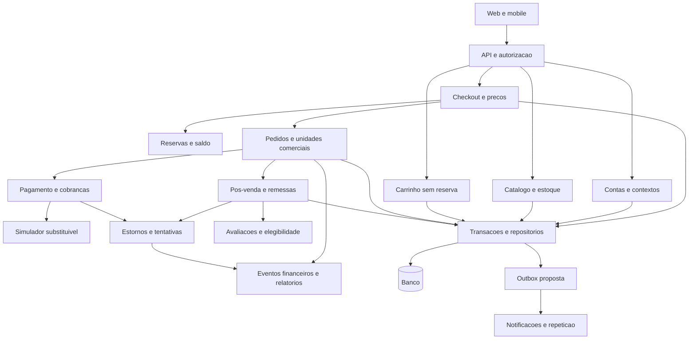

# Componentes propostos

ADR-001/003/004/005/006 PROPOSED. Módulos lógicos; fronteiras físicas e stack ainda serão ratificadas. O simulador local é decisão de produto confirmada.

```mermaid
flowchart TD
  UI[Web e mobile] --> REST[API e autorizacao]
  REST --> ACC[Contas e contextos]
  REST --> CAT[Catalogo e estoque]
  REST --> CART[Carrinho sem reserva]
  REST --> CHECK[Checkout e precos]
  CHECK --> INV[Reservas e saldo]
  CHECK --> ORDER[Pedidos e unidades comerciais]
  ORDER --> PAY[Pagamento e cobrancas]
  PAY --> SIM[Simulador substituivel]
  ORDER --> AFTER[Pos-venda e remessas]
  AFTER --> REF[Estornos e tentativas]
  PAY --> REF
  AFTER --> REV[Avaliacoes e elegibilidade]
  ORDER --> REPORT[Eventos financeiros e relatorios]
  REF --> REPORT
  CHECK --> PERSIST[Transacoes e repositorios]
  ACC --> PERSIST
  CAT --> PERSIST
  CART --> PERSIST
  ORDER --> PERSIST
  AFTER --> PERSIST
  PERSIST --> DB[(Banco)]
  PERSIST --> OUT[Outbox proposta]
  OUT --> MSG[Notificacoes e repeticao]
```
