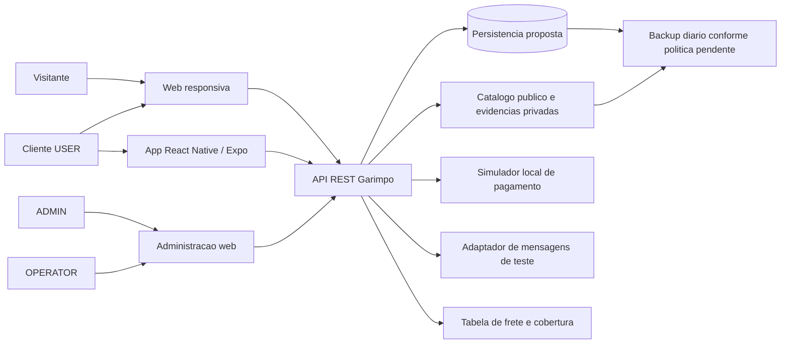

# Contexto do Garimpo

Fonte: RN-001, RN-032, RN-033. Plataforma e implantação pendentes; contas internas não compram.

```mermaid
flowchart LR
  V[Visitante] --> WEB[Web responsiva]
  C[Cliente USER] --> WEB
  C --> MOBILE[App React Native / Expo]
  A[ADMIN] --> BACK[Administracao web]
  O[OPERATOR] --> BACK
  WEB --> API[API REST Garimpo]
  MOBILE --> API
  BACK --> API
  API --> DB[(Persistencia proposta)]
  API --> FILES[Catalogo publico e evidencias privadas]
  API --> PAY[Simulador local de pagamento]
  API --> MSG[Adaptador de mensagens de teste]
  API --> FRETE[Tabela de frete e cobertura]
  DB --> BK[Backup diario conforme politica pendente]
  FILES --> BK
```
